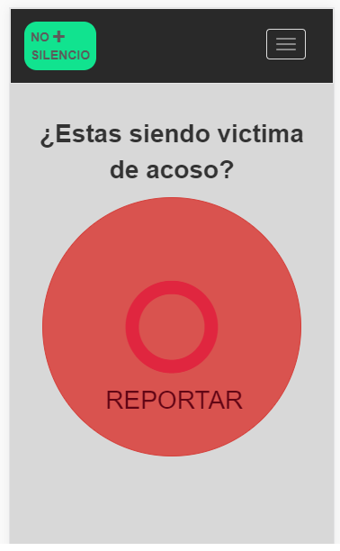

EVENTO: HACKATON - "IGUALDAD DE GÉNERO"
======================================

GRUPO: THE POWER CODE STRIKES BACK
---------------------------------------

## PROYECTO: NO+SILENCIO

## BREVE EXPLICACION: 
- Una App “Botón Alarma que Reporta el Acoso Sexual en el Metropolitano” .Este Aplicativo le permite a la victima ó testigo generar una alerta al equipo de seguridad para que realice la intervención de la persona señalada en la siguiente estación del metropolitano a la que se encuentre,  logrando promover la generación de espacios libres de violencia sexual en el transporte público, atraves de una estrategia de prevención , disuación e intervención frente a un reporte de acoso sexual.

## INTEGRANTES:  
- Betsy Dessiré Lara Aspilcueta - betsy_dessire@hotmail.com
- Betsy Brigitte Vidal Espinoza - ing.betsyvies@gmail.com
- Lisseth Vanessa Colqui Santos - vanessa.colsan@gmail.com
- Esthefany Humpiri Vargas - tefavv22@gmail.com
- Yenny Elizabeth Quiñones Jauregui - yenny.quinones.jauregui@gmail.com

## PROTOTIPO :
----------------------

## ANEXOS

